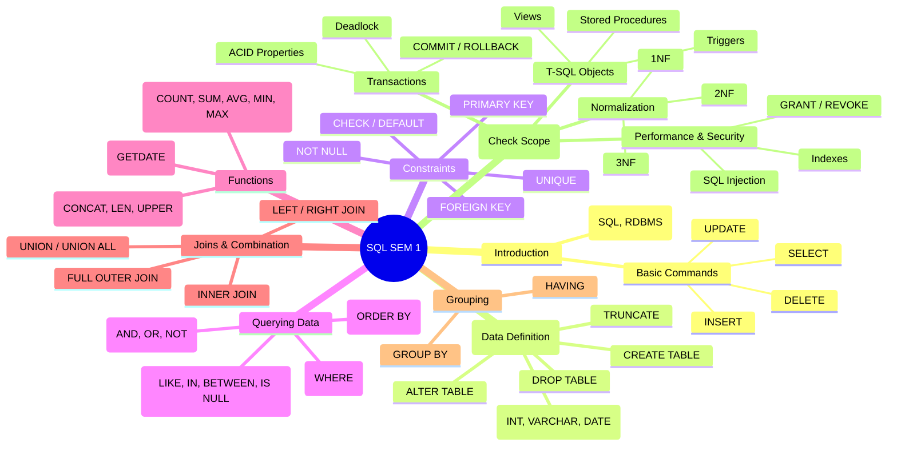

# SQL Syllabus Mind Map (Generated from current Question Bank)

> [!NOTE]
> This mind map is generated based on the structure of `questions.py` as I cannot directly read the text from `SEM 1.png`. Please use this to verify if the codebase matches your intended syllabus.

